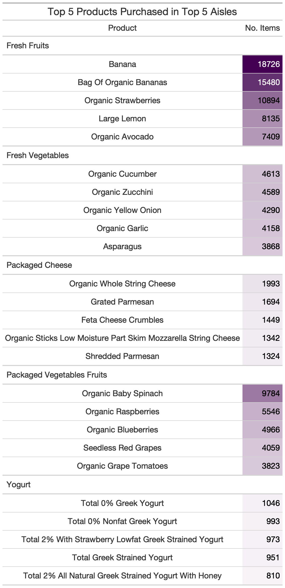

PUBH 7462 Homework 3
================
Jack Rabe
2/15/2022

-   [Problem 3. Instacart](#problem-3-instacart)
    -   [Problem 3.1 Create a gt() table summarizing
        numeric](#problem-31-create-a-gt-table-summarizing-numeric)
    -   [Problem 3.2 Create a plot of number of orders per
        aisle](#problem-32-create-a-plot-of-number-of-orders-per-aisle)
    -   [3.3 Plot of top 6 aisles in top 6 departments by number of
        items
        purchased](#33-plot-of-top-6-aisles-in-top-6-departments-by-number-of-items-purchased)
    -   [3.4 gt() table of top 6 aisles in top 6 departments by number
        of items
        purchased](#34-gt-table-of-top-6-aisles-in-top-6-departments-by-number-of-items-purchased)

# Problem 3. Instacart

Let’s start by loading in the data set

``` r
#load data and change variable types where appropriate
instacart.df <- read.csv(file = "./data/instacart.csv", header = TRUE) %>% 
  as_tibble() %>% 
  mutate(
    order_id = as.factor(order_id), 
    product_id = as.factor(product_id),
    reordered = as.factor(reordered) %>% #change from integer to factor and levels from 1 and 0 to yes and no
      fct_recode(
        "Yes" = "1",
        "No" = "0"
      ) %>% 
      fct_relevel("Yes"),
    user_id = as.factor(user_id),
    aisle_id = as.factor(aisle_id),
    aisle = as.factor(aisle),
    department_id = as.factor(department_id),
    department = as.factor(department)
  )
```

## Problem 3.1 Create a gt() table summarizing numeric

``` r
instacart.df %>% 
  group_by(user_id, order_id) %>% 
  summarise(
    "Days Since Last Order" = days_since_prior_order, #all values same so no need to change
    "No. Items" = n(), #number of items purchased
    "No. Aisles" = n_distinct(aisle_id), #number of aisles visited
    "No. Departments" = n_distinct(department_id), #number of departments visited
    "Order No." = order_number, #all values same so don't need to change
    "% Reordered" = (sum(reordered == "Yes") / n()) * 100 #percent of Yes responses in each order
  ) %>% 
  ungroup() %>% 
  summarise(
    across(
      contains(c("Days Since", "No.", "%")),
      list(mean = mean, median = median, sd = sd), na.rm = TRUE,
      .names = "{.col} ({.fn})"
    )
  ) %>%
pivot_longer(
cols = everything(),
names_to = "Metric",
values_to = "Value"
) %>%
  gt() %>% 
  tab_header("Summary Stats of Trips to the Grocery Store") %>% 
  fmt_number(
     columns = Value,
     decimals = 1) %>% 

#Save gt
#Create a figures directory and save the gt as a .png in there
gtsave("./figures/gt_sumstats.png") #save it
```


## Problem 3.2 Create a plot of number of orders per aisle

``` r
instacart.df %>% 
  mutate(
   aisle = str_to_title(aisle)
  ) %>% 
  group_by(aisle) %>% 
  summarise(n_orders = n_distinct(order_id)) %>% #number of orders per aisle
  drop_na() %>%
  ungroup() %>%
  mutate(aisle = fct_reorder(aisle, n_orders, .desc = FALSE)) %>% 
  
  #now plot it all
  ggplot(aes(y = aisle, 
             x = n_orders, 
             color = aisle)) +
  geom_segment(aes(x = 0, xend = n_orders, y = aisle, yend = aisle),
               size = 1.5, alpha = 0.5) +
  geom_point(size     = 2, 
             shape    = 16) +
  labs(
    x = "No. of Orders",
    y = "Aisle",
    title = "Number of Orders per Aisle"
  ) +
  theme(axis.text.x = element_text(size  = 11),
        axis.text.y = element_text(size  = 9)) +
  scale_colour_viridis_d(direction = -1) + #reverse order of color gradient
  theme(legend.position = "none")
```


## 3.3 Plot of top 6 aisles in top 6 departments by number of items purchased

``` r
#step 1, narrow down by top 6 dept and store
instacart.top6 <- instacart.df %>% 
  mutate(
   aisle = str_to_title(aisle),
   department = str_to_title(department)
  ) %>% 
  group_by(department) %>%
  summarise(
    n_items = n()
  ) %>% 
  mutate(
    department = fct_reorder(department, n_items, .desc = TRUE)
  ) %>%
  group_by(department) %>% 
  slice(1:6)
 
#step 2, filter by top 6 and get top 6 aisles within, then plot
instacart.df %>%
  mutate(
   aisle = str_to_title(aisle),
   department = str_to_title(department)
  ) %>% 
  #filter by top 6 departments
  filter(
    department == "Produce" |
      department == "Dairy Eggs" |
      department == "Snacks" |
      department == "Beverages" |
      department == "Frozen" |
      department == "Pantry"
  ) %>% 
group_by(department, aisle) %>%
  summarise(
    n_items = n()
  ) %>% 
  mutate(
    aisle = fct_reorder(aisle, n_items, .desc = TRUE)
  ) %>%
  slice(1:6) %>% 

  #now plot it all
  ggplot(aes(x = n_items, y = aisle, color = aisle)) +
  geom_segment(aes(x = 0, xend = n_items, y = aisle, yend = aisle),
               size = 1.5, 
               alpha = 0.5) +
  geom_point(size     = 2, 
             shape    = 16) +
  labs(
    x = "No. of Items Purchased",
    y = "Aisle",
    title = "Top 6 Departments and Aisles\nwith Most Items Purchased"
  ) +
  scale_colour_viridis_d(direction = -1) + #reverse order of color gradient
  facet_wrap(~ department, scales = "free_x") +
  theme(axis.text.x = element_text(size  = 6),
        axis.text.y = element_text(size  = 6)) +
  theme(legend.position = "none")
```


## 3.4 gt() table of top 6 aisles in top 6 departments by number of items purchased

``` r
#step 1, narrow down by top 5 aisle and store
instacart.top5 <- instacart.df %>% 
  mutate(
   aisle = str_to_title(aisle),
   department = str_to_title(department)
  ) %>% 
  group_by(aisle) %>%
  summarise(
    n_items = n()
  ) %>% 
  mutate(
    aisle = fct_reorder(aisle, n_items, .desc = TRUE)
  ) %>%
  group_by(aisle) %>% 
  slice(1:5)

#step 2, filter by top 5 and get top 5 products within, then make table
instacart.df %>%
  mutate(
   aisle = str_to_title(aisle),
   product_name = str_to_title(product_name)
  ) %>% 
  #filter by top 5 aisles
  filter(
    aisle == "Fresh Vegetables" |
      aisle == "Fresh Fruits" |
      aisle == "Packaged Vegetables Fruits" |
      aisle == "Yogurt" |
      aisle == "Packaged Cheese"
  ) %>% 
  group_by(aisle, product_name) %>%
  summarise(
    n_items = n()
  ) %>%
  mutate(
    product_name = fct_reorder(product_name, n_items, .desc = TRUE)
  ) %>% 
  arrange(aisle, product_name, .desc = n_items) %>% 
  slice(1:5) %>%
  rename(
    Product = product_name,
    "No. Items" = n_items
  ) %>% 
  gt() %>% 
  tab_header("Top 5 Products Purchased in Top 5 Aisles") %>% 
  data_color(
    columns = "No. Items",
    colors = scales::col_numeric(
      palette = c("white", my_purple),
      domain  = c(0, 18726))) %>% 

#Save gt
#Create a figures directory and save the gt as a .png in there
gtsave("./figures/gt_aisleitems.png") #save it
```


